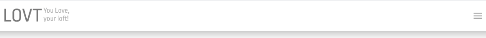
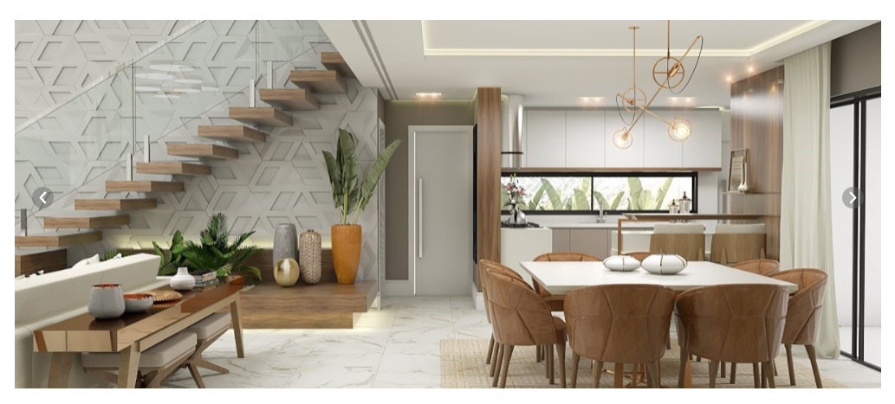
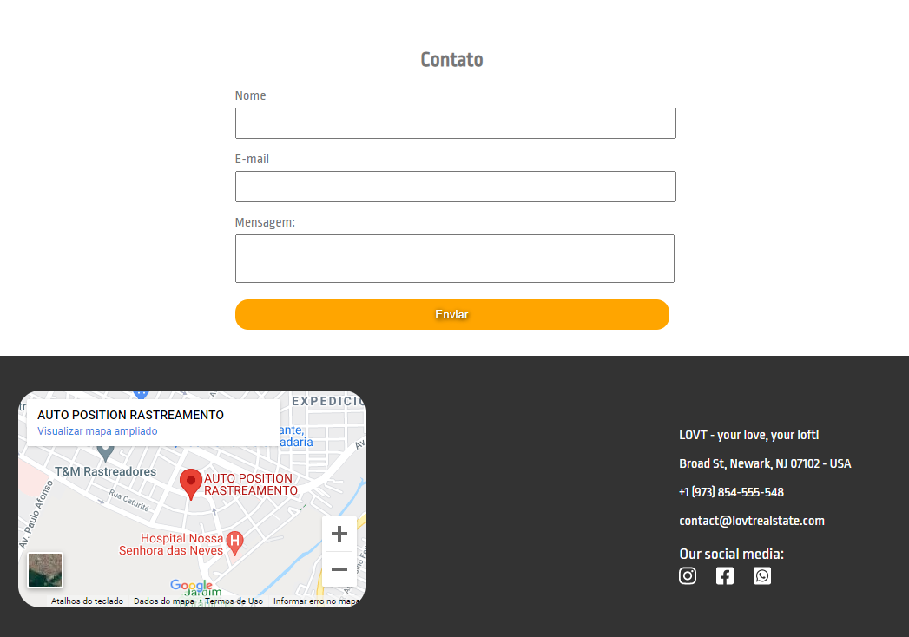

# LOVT

<!---Esses são exemplos. Veja https://shields.io para outras pessoas ou para personalizar este conjunto de escudos. Você pode querer incluir dependências, status do projeto e informações de licença aqui--->

<!--- /github/languages/code-size/:user/:repo --->

> Challenge suggested in the Full-stack developer course of Digital House Brazil.

## 📝 About
This is a project developted with HTML and CSS suggestest in the full-stack developer carrer course made on Digital House Brazil school.

## 📷 Pictures

> Header.

> Carousel.

> Articles.

> Form and Footer

## 💻 Required

* This project works in anu desktop browser, isn't yet responsible for mobile devices.

## 🔗 Preview

* If you want to see the project deployed, click on the link [link](https://lovt-dh.netlify.app/).

## 🤝 Collaborators

This project was made by:

<table>
  <tr>
    <td align="center">
      <a href="https://github.com/Desenvigor">
         
        
          <b>Igor Aguiar</b>
        
      </a>
    </td>
  </tr>
</table>

## 📝 License

MIT

[⬆ Voltar ao topo](#LOVT) 